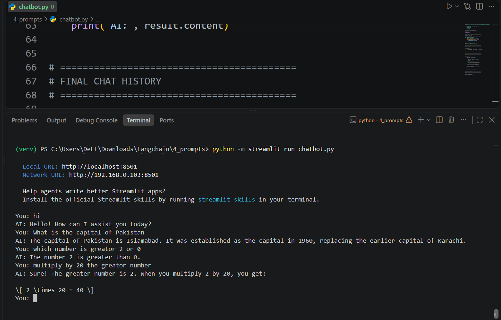
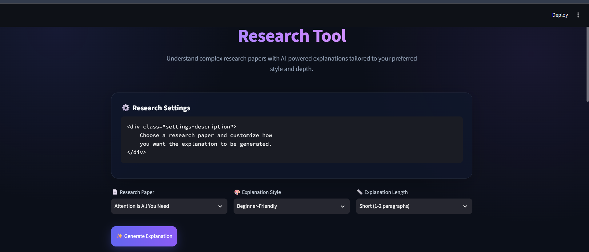
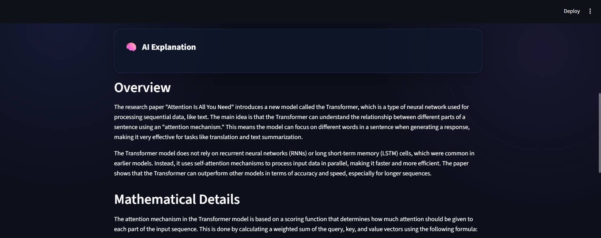
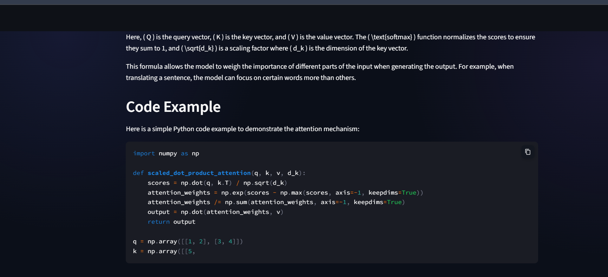

# Prompt Engineering & Prompt Templates

This folder contains examples of **Prompt Engineering** and different ways to create, manage, and use prompts with LangChain.

## Overview

Prompt engineering is the process of designing effective instructions for a Large Language Model (LLM) so that it produces useful, relevant, and consistent responses.

The `4_prompts` folder demonstrates:

- Prompt templates
- Dynamic prompts
- Chat prompts
- Prompt generation
- JSON-based templates
- Temperature settings
- Building a simple chatbot
- Creating a user interface for prompts

## Files in This Folder

| File | Description |
|---|---|
| `chatbot.py` | Main chatbot example |
| `prompt_generator.py` | Generates prompts dynamically |
| `prompt_ui.py` | User interface for working with prompts |
| `chat_prompt_template.py` | Example of a chat prompt template |
| `prompt_template.py` | Basic prompt template example |
| `message_placeholder.py` | Demonstrates message placeholders |
| `messages.py` | Working with structured messages |
| `temperature.py` | Demonstrates the effect of temperature |
| `template.json` | JSON-based prompt/template configuration |
| `chat_history.txt` | Example chat history |
| `prompt_1.png` | Screenshot of the prompt interface |
| `prompt_2.png` | Screenshot showing prompt configuration/details |
| `prompt_3.png` | Screenshot showing another prompt example |
| `chatbot_working.png` | Screenshot of the working chatbot |

---

# Prompt Templates

A prompt template allows us to create reusable prompts instead of writing the complete prompt manually every time.

For example:

```python
from langchain_core.prompts import PromptTemplate

prompt = PromptTemplate.from_template(
    "Explain {topic} in simple words."
)

result = prompt.invoke({"topic": "Artificial Intelligence"})

print(result)
```

Here, `{topic}` is a variable that can be changed dynamically.

## Basic Flow

```text
User Input
    ↓
Prompt Template
    ↓
Formatted Prompt
    ↓
LLM / Chat Model
    ↓
Response
```

---

# Chat Prompt Templates

Chat prompts are designed for conversational AI applications.

A chat prompt can contain different message types:

- System message
- Human message
- AI message
- Placeholder messages

Example:

```python
from langchain_core.prompts import ChatPromptTemplate

prompt = ChatPromptTemplate.from_messages([
    ("system", "You are a helpful assistant."),
    ("human", "{question}")
])

result = prompt.invoke({
    "question": "What is LangChain?"
})

print(result)
```

---

# Message Placeholders

A message placeholder can be used when we want to insert a list of previous conversation messages into a prompt.

Conceptually:

```text
System Message
      ↓
Chat History
      ↓
Current User Message
      ↓
Chat Model
      ↓
AI Response
```

This is useful when building conversational chatbots that need to remember previous messages.

---

# Temperature

Temperature controls how much variation the model can use when generating responses.

Generally:

- Lower temperature → more consistent responses
- Higher temperature → more varied/creative responses

Example:

```python
model = ChatOpenAI(
    model="gpt-4o-mini",
    temperature=0.7
)
```

The appropriate value depends on the application.

---

# Prompt Generator

`prompt_generator.py` demonstrates how prompts can be generated dynamically.

Instead of hard-coding every prompt, user input can be combined with a template to create the final prompt.

```text
User Requirements
       ↓
Prompt Generator
       ↓
Generated Prompt
       ↓
LLM
       ↓
Response
```

---

# JSON Template

`template.json` demonstrates storing prompt configuration in JSON format.

Using a separate JSON file can make prompts easier to manage and modify without changing the Python source code.

Example structure:

```json
{
    "template": "Explain {topic} in simple language."
}
```

---

# Chatbot

`chatbot.py` demonstrates how these concepts can be combined to create a simple chatbot.

A simplified chatbot architecture is:

```text
User
 ↓
Prompt / Chat Interface
 ↓
Prompt Template
 ↓
Chat Model
 ↓
Response
 ↓
User
```

## Chatbot Working

The following screenshot shows the chatbot working:



---

# Prompt Examples

## Prompt Interface



The screenshot above demonstrates the prompt interface used in this project.

## Prompt Configuration



This screenshot demonstrates another stage of the prompt configuration/processing workflow.

## Prompt Example



This screenshot shows another example of a prompt and its generated/configured content.

---

# Why Prompt Engineering is Important

Good prompts can help an AI system produce:

- More relevant responses
- More consistent outputs
- Better structured information
- More accurate task-specific results
- Better control over the model's behavior

Prompt engineering becomes especially useful when building applications such as:

- AI chatbots
- Question-answering systems
- Research assistants
- Content generation systems
- RAG applications
- Agentic AI systems

---

# Learning Goals

After completing this folder, you should understand:

- What prompt engineering is
- What a prompt template is
- How variables are used in prompts
- How chat prompt templates work
- How message placeholders work
- How temperature affects model output
- How to create dynamic prompts
- How prompts can be stored in JSON
- How prompt components can be combined to build a chatbot

---

## Related Concepts

This folder builds on the concepts from:

```text
1_LLM
    ↓
2_ChatModels
    ↓
3_EmbeddingModels
    ↓
4_prompts
```

Prompts are an important component of larger LangChain applications, including **RAG, chatbots, and Agentic AI systems**.
